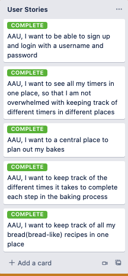

# Hedda

Hedda is a Django application that allows a user to keep track of all the timers for each step in a (sourdough) bread baking process. There are around 20 meticulous steps that go into making a proper sourdough loaf so timing is essential. This app helps the user keep track of all the timers they use by storing them all in one place.

# App Demo Links
- [Hedda Repo](https://github.com/katiacreator/hedda)
- [Deployed Link](getbready@herokuapp.com)

# Why the name Hedda?
I named this app after the sourdough starter the primary user of this app uses to make her sourdough bread. Hedda is very much a living breathing being, so she was given a proper name from the user's heritage.

## Features
- mobile responsive
- side navigation on mobile screen
- customizable timers
- 
## Screenshots

## User Stories

## Icebox
- Timer Sound
- Slider with all the timers
- Photo model
- AWS bucket so user can upload photos of the baking process from start to finish
- light/dark mode
- tweak mobile responsiveness

## Acknowledgements

 - [Readme.so: Readme Editor](https://readme.so/)
 - [bedimcode: Responsive Landing Page Design Tutorial](https://github.com/bedimcode/responsive-landing-page-coffee3d/blob/master/index.html)
 - [David Stinson: CSS Styling Support](https://github.com/DavidStinson)
 - [Ben Manley: JS Timers Lecture](https://github.com/ManliestBen)
 - [learn-webdevYT: countdown timer tutorial](https://github.com/learn-webdevYT/countdown-timer/)
 - [Cory Rice: Sqlite Translation Support & Deployment Support](https://github.com/crice802)
 - [Blake Romano: Deployment Support](https://github.com/blakeromano)
 - [Julie B] my awesome former housemate who requested this app, and supplier of photos and phrase- 'Get Bready'.
 - Hedda who makes a delicious pizza crust

## Documentation

- [Django](https://docs.djangoproject.com/en/3.2/intro/tutorial01/)
- [Python](https://docs.python.org/3/)
- [Postgresql](https://www.postgresqltutorial.com/)
- [What is a Javascript?](https://developer.mozilla.org/en-US/docs/Web/JavaScript)

## Authors
- [katiacreator](https://www.github.com/katiacreator)
- 

  
