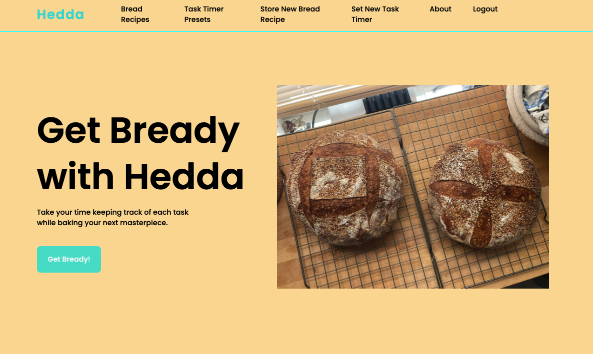

# Hedda

Hedda is a Django application that allows a user to keep track of all the timers for each step in a (sourdough) bread baking process. There are around 20 meticulous steps that go into making a proper sourdough loaf so timing is essential. This app helps the user keep track of all the timers they use by storing them all in one place.

# App Demo Links
- [Hedda Repo](https://github.com/katiacreator/hedda)
- [Deployed Link](getbready@herokuapp.com)

# Why the name Hedda?
I named this app after the sourdough starter the primary user of this app uses to make her sourdough bread. Hedda is very much a living breathing being, so she was given a proper name from the user's heritage.

## Features
- mobile responsive
- side navigation on mobile screen
- customizable timers

## Icebox
- Timer Sound
- Slider with all the timers
- Photo model
- AWS bucket so user can upload photos of the baking process from start to finish
- light/dark mode
- tweak mobile responsiveness

## Acknowledgements

 - [Awesome Readme Templates](https://awesomeopensource.com/project/elangosundar/awesome-README-templates)
 - [Awesome README](https://github.com/matiassingers/awesome-readme)
 - [How to write a Good readme](https://bulldogjob.com/news/449-how-to-write-a-good-readme-for-your-github-project)
 - [bedimcode](https://github.com/bedimcode/responsive-landing-page-coffee3d/blob/master/index.html)
 - [David Stinson](https://github.com/DavidStinson)
 - [Ben Manley](https://github.com/ManliestBen)
 - [Cory Rice](https://github.com/crice802)
 - [Blake Romano](https://github.com/blakeromano)
 - [Julie B] my awesome former housemate who requested this app, and without her financial contribution I would not be able to complete this bootcamp.

## Documentation

- [Django](https://linktodocumentation)
- [Python](https://linktodocumentation)
- [Postgresql](https://linktodocumentation)
- [What is a Javascript?](https://linktodocumentation)

## Screenshots

## Authors

- [katiacreator](https://www.github.com/katiacreator)
- 

  
